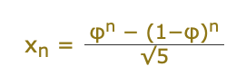

# Lab: Class 02 - Modules and Testing (math-series)
link to PR:

click to [series.py](math_series/series.py)

click to [test_series.py](tests/test_series.py)
## Overview
The Fibonacci Series is a numeric series starting with the integers 0 and 1. In this series, the next integer is determined by summing the previous two. This gives us:

|n =|0|1|2|3|4|5|6|7|8|9|10|11|12|13|14|...|
|--|--|--|--|--|--|--|--|--|--|--|--|--|--|--|--|--|
|xn =|0|1|1|2|3|5|8|13|21|34|55|89|144|233|377|...|

the fomula is:


The **Lucas Numbers** are a related series of integers that start with the values 2 and 1 rather than 0 and 1. They share the same fomula to calculate the nth value when n is greater than 0.


## Feature Tasks and Requirements
- Create a module ```series.py```.
- Add a file ```test_series.py ```to your repository. As you work on the tasks below, use TDD practices. Write tests first, then implement code. Make small changes with many cycles of Red-Green-Refactor


- Create a function called **fibonacci**. The function should have one parameter **n**. The function should return the nth value in the fibonacci series. You may implement the function using recursion or iteration. If you are feeling particularly frisky, do both as separate functions.

- Ensure that your function(s) has a well-formed docstring

- In your **series.py** module, add a new function **lucas** that returns the nth value in the lucas numbers Again, you may use recursion or iteration, or both. Again, ensure that your function has a well-formed docstring.

- Both the fibonacci series and the lucas numbers are based on an identical formula. Add a third function called **sum_series** with one required parameter and two optional parameters. The required parameter will determine which element in the series to print. The two optional parameters will have default values of 0 and 1 and will determine the first two values for the series to be produced.

- Calling this function with no optional parameters will produce numbers from the fibonacci series. Calling it with the optional arguments 2 and 1 will produce values from the lucas numbers. Other values for the optional parameters will produce other series. Again, you may use recursion or iteration, or both. Again, ensure that your function has a well-formed docstring.


##  Distributor
Peng Chen

